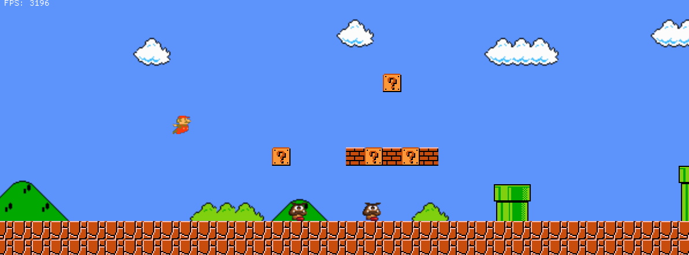

# Rustario2D

**Rustario2D** is a simple 2D platformer inspired by Mario, developed in Rust as a learning project. It includes an animation system for displaying multiple animations, basic 2D collision handling using dynamic dispatch, and classic Mario-style gameplay.

## Features

- **Animation System**: Supports multiple animations for characters and objects.
- **2D Collisions**: Simple collision detection, including handling for platforms, obstacles, and enemies.
- **Classic Gameplay**: Control the character using arrow keys or WASD to navigate through the level.

## Getting Started

To run the game, use the following commands in the root directory of the project:

cargo run

Or for a release build:

cargo run --release

### Controls

- **Arrow Keys** or **WASD**: Move the character left, right, jump, and crouch.

## Known Limitations

- **Animation Issues**: The animation system has some bugs when finishing the game.
- **Collision System**: Rarely, collisions can be finicky due to diagonal checking when updating the x velocity.
- **Score System**: Basic scoring is implemented but needs refinement.
- **Level Data**: The level data currently lacks information about "Powerup Blocks" (any block with `?`). Powerups and coins are not fully implemented.

## License

This project is licensed under the MIT License.
